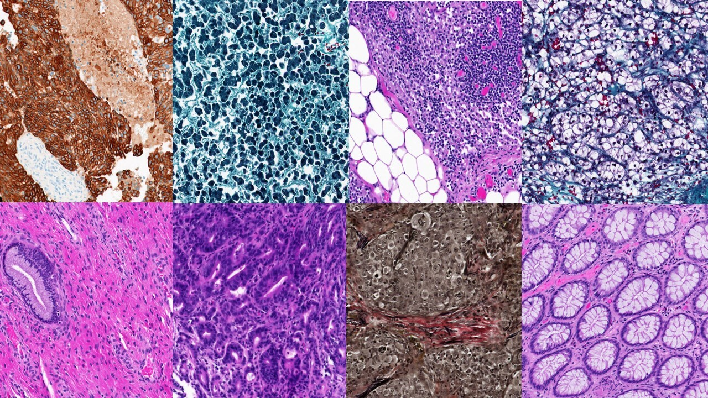

# Kimia Path24 - Colored Kimia Path24 Dataset: Configurations and Benchmarks with Deep Embeddings
### Paper Abstract
The Kimia Path24 dataset has been introduced as a classification and retrieval dataset for digital pathology. Although it provides multi-class data, the color information has been neglected in the process of extracting patches. The staining information plays a major role in the recognition of tissue patterns. To address this drawback, we introduce the color version of Kimia Path24 by recreating sample patches from all 24 scans to propose Kimia Path24C. We run extensive experiments to determine the best configuration for selected patches. To provide preliminary results for setting a benchmark for the new dataset, we utilize VGG16, InceptionV3 and DenseNet-121 model as feature extractors. Then, we use these feature vectors to retrieve test patches. The accuracy of image retrieval using DenseNet was 95.92% while the highest accuracy using InceptionV3 and VGG16 reached 92.45% and 92%, respectively. We also experimented with "deep barcodes" and established that with a small loss in accuracy (e.g., 93.43% for binarized features for DenseNet instead of 95.92% when the features themselves are used), the search operations can be significantly accelerated.

[](https://kimialab.uwaterloo.ca/kimia/index.php/pathology-images-kimia-path24/)

See image source at [Kimia Lab](https://kimialab.uwaterloo.ca/kimia/index.php/pathology-images-kimia-path24/)

### Dataset Details
The Kimia Path24C is a dataset for image classification and retrieval in digital pathology. We had 350 whole slide images (WSIs) from diverse body parts at our disposal. The images were captured by TissueScope LE 1.0. The scans were performed in the bright field using a 0.75 NA lens. We manually selected 24 WSIs purely based on visual distinction for non-clinical experts, which means, in our selection, we made a conscious effort to select a subset of the WSIs such that they clearly represent different texture patterns.
The dataset contains 22,591 training patches and 1,325 test patches of size 1000 x 1000 (0.5mm × 0.5mm) extracted from all 24 WSIs. This dataset is for academic and research applications only. If you use this dataset, please cite the following papers:

```
@misc{shafiei2021colored,
title={Colored Kimia Path24 Dataset: Configurations and Benchmarks with Deep Embeddings}, 
author={Sobhan Shafiei and Morteza Babaie and Shivam Kalra and H. R. Tizhoosh},
year={2021},
eprint={2102.07611},
archivePrefix={arXiv},
primaryClass={eess.IV}}

@inproceedings{babaie2017classification,
title={Classification and retrieval of digital pathology scans: A new dataset},
author={Babaie, Morteza and Kalra, Shivam and Sriram, Aditya and Mitcheltree, Christopher and Zhu, Shujin and Khatami, Amin and Rahnamayan, Shahryar and Tizhoosh, Hamid R},
booktitle={Proceedings of the IEEE Conference on Computer Vision and Pattern Recognition Workshops},
pages={8--16},
year={2017}}
```

### Useful Links
- [Paper Link](https://arxiv.org/abs/2102.07611)
- [Learn more on Kimia Lab](https://kimialab.uwaterloo.ca/kimia/index.php/pathology-images-kimia-path24/)
### Disclaimer
Rhazes Lab does not own the code in this repository. This code and data were produced in Kimia Lab at the University of Waterloo. The code is provided as-is without any guarantees, and is stored here as part of Kimia Lab's history. We welcome questions and comments.

Before using or cloning this repository, please read the [End User Agreement](agreement.pdf).
